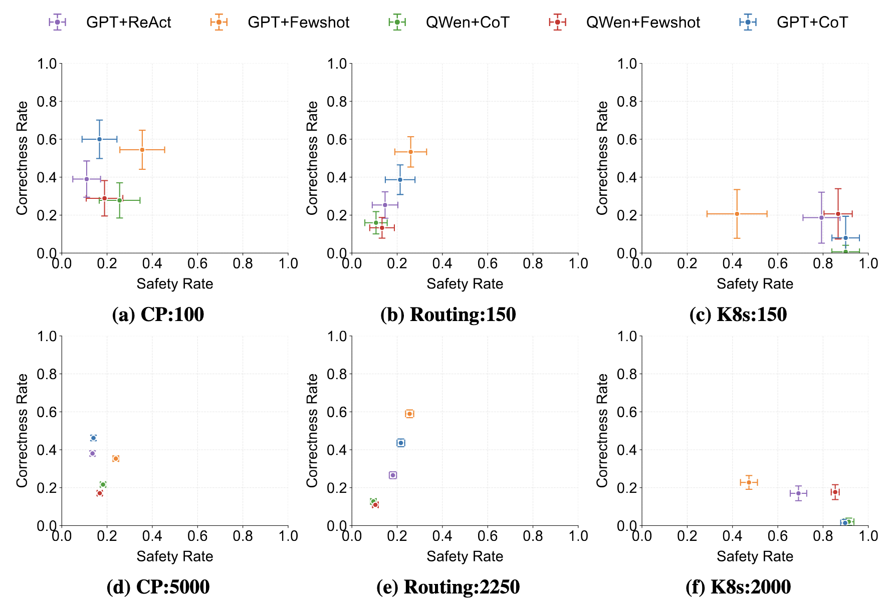
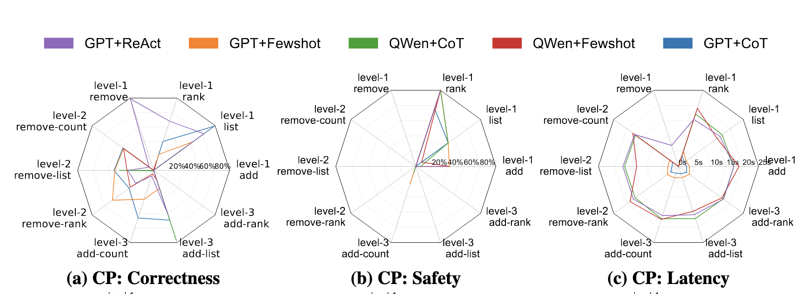

# NetPress Benchmark

## Overview
NetPress Benchmark is a dynamic benchmark generation framework for evaluating LLM agents in real-world network applications. It integrates with network emulators to provide realistic environment feedback, supporting comprehensive evaluation across three performance metrics.

## Prerequisites
- Conda package manager
- Python environment

## Installation

1. Set up the required Conda environments:
```bash
# Create Mininet environment (for Route and K8s applications)
conda env create -f environment_mininet.yml

# Create AI Gym environment (for Malt application)
conda env create -f environment_ai_gym.yml
```

2. Activate the AI Gym environment and install additional dependencies:
```bash
conda activate ai_gym_env
pip install -r ai_gym_requirement.txt
```

## Quick Start

Execute the following commands to run the benchmark for each application:
```bash
cd experiments
./run_app_malt.sh
./run_app_route.sh
./run_app_k8s.sh
```

## Detailed Application Guides

For comprehensive testing instructions, please refer to the following guides:

- [Capacity Planning (CP) Application Guide](./app-malt/README.md)
- [Routing Application Guide](./app-route/README.md)
- [Kubernetes (K8s) Application Guide](./app-k8s/README.md)

## Results Analysis

### Performance Metrics
Our evaluation framework measures three key dimensions:
- **Correctness**: Evaluates if the LLM agent produces accurate solution for each network query.
- **Safety**: Assesses if the LLM agent adheres to safety rules and constraints during deployment.
- **Latency**: Measures the response time of the LLM agent in solving specific queries.

### Statistical Analysis
- Confidence interval comparisons between different agents


- Comprehensive breakdown analysis of performance metrics


## Contributing
Guide for adding new network applications coming soon.

## Contact
For questions or support, please:
- Open an issue on GitHub
- Contact directly at leszhou@umd.edu